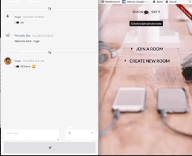

# node_chat_room
NodeJs Mongodb Socket.io Realtime chat

### Setup  

+ Install Node js Read docs  
+ Install mongodb mongodb 

 

##### Start mongodb: <Terminal>

    $ mongod  

### Start app: <separate Terminal>

    $ cd <pathTo>/node_chat_room/   
    $ npm install  
    $ yarn start <or> npm run start  

   

*Open your favourite browser at localhost:3000*   

   
## Desktop    

   
   
  
#### Web App 
   
  

